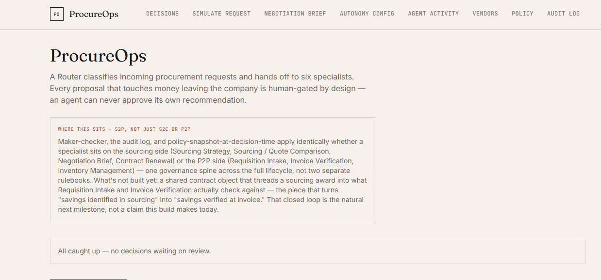
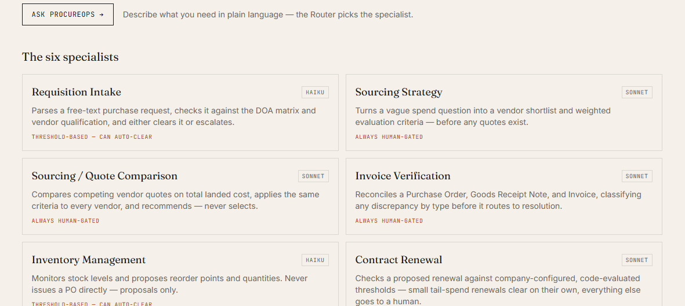
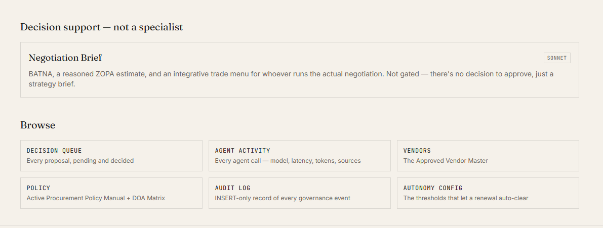
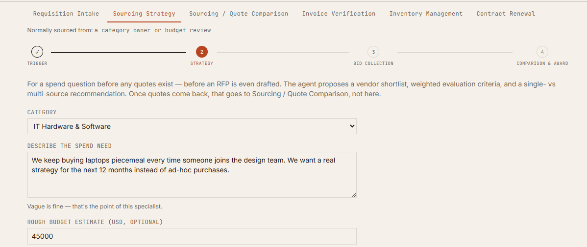

# ProcureOps

**Live demo:** [procureops.krishnaparuchuri.com](https://procureops.krishnaparuchuri.com/)
**Repo:** this one — backend and frontend live side by side, deploy together

An AI Router + **6 specialists** governing a procurement workflow end to end —
requisition, sourcing strategy, quote comparison, invoice three-way match,
inventory reorder, and bounded-autonomy contract renewal. Third vertical
alongside GMP Deviation Review and MediAssist in the AgentOps portfolio,
sharing the same governance backbone (maker-checker, INSERT-only audit log,
LLM-as-judge eval framework) and adding policy-snapshot-at-decision-time,
which neither of the other two implements.

**No real ERP or payment integration.** This is a governance-architecture
demo against a realistic procurement domain, not a working procurement
system — every vendor, requisition, and invoice in it is test data.

See [`docs/ARCHITECTURE.md`](docs/ARCHITECTURE.md) for the full design
rationale, reviewed and confirmed before implementation began.

## Where this sits — S2C, P2P, or S2P?

Sourcing (S2C) tools optimize vendor discovery and negotiation; P2P tools
optimize requisition-to-payment execution; S2P platforms unify both with
shared governance so savings identified in sourcing get verified downstream.
ProcureOps earns the **governance** half of that S2P claim — maker-checker,
the audit log, and policy-snapshot compliance apply identically whether a
specialist sits on the sourcing side (Sourcing Strategy, Sourcing / Quote
Comparison, Negotiation Brief, Contract Renewal) or the P2P side
(Requisition Intake, Invoice Verification, Inventory Management). It does
**not** yet earn the closed-loop data half: there's no shared contract
object that threads a sourcing award into what Requisition Intake or Invoice
Verification actually check against. That's the natural next milestone, not
a claim this build makes today.

## What It Does

A Router classifies incoming requests and hands off to six specialists:

| Agent | Role | Model | Gated? |
|---|---|---|---|
| Router | Classifies request → specialist | Haiku | n/a |
| Requisition Intake | DOA/budget validation, missing-field checks | Haiku | Threshold-based — can auto-clear |
| Sourcing Strategy | Vendor shortlist + weighted evaluation criteria, before quotes exist | Sonnet | **Always** |
| Sourcing / Quote Comparison | Total-landed-cost vendor comparison + winner's-curse price check | Sonnet | **Always** |
| Invoice Verification | Three-way match (PO/GRN/Invoice) | Sonnet | **Always** |
| Inventory Management | Reorder point/quantity proposals | Haiku | Threshold-based — can auto-clear |
| Contract Renewal | Renewal terms vs. company-configured thresholds | Sonnet | Bounded autonomy — can auto-clear |

Sourcing Strategy, Sourcing / Quote Comparison, and Invoice Verification
touch money leaving the company or shape a real RFP — no autonomous
approval, ever. Every proposal from those three becomes a `decision_reviews`
row that stays `decision=NULL` until a human, who cannot be the proposing
agent, approves or rejects it.

Also included, not gated (it's decision support, not a decision):
**Negotiation Brief** — BATNA, a reasoned ZOPA estimate, and an integrative
trade menu for whoever runs the actual negotiation, paired with a real
computed win-probability layer from historical negotiation outcomes (never
an LLM-invented percentage).

## What makes this one different

- **Bounded autonomy, not blanket autonomy.** Contract Renewal only
  auto-clears against thresholds a company explicitly configures per
  category (`agents/autonomy_rules.py`) — evaluated as plain code, never LLM
  judgment. Every threshold is visible and editable in the Autonomy Config
  UI, with a live count of how many real vendors a given band actually
  applies to.
- **Winner's-curse price flagging.** A quote that lands far below *that same
  vendor's own* trailing price history for the category gets flagged —
  never compared across vendors, since unit-price scale differs entirely by
  category (`agents/winners_curse.py`, pure SQL/stats, no LLM).
- **Game-theoretic negotiation and auction support.** Negotiation Brief
  reasons in BATNA/ZOPA/trade-menu terms; Sourcing Strategy recommends a
  bidding mechanism (sealed-bid / English reverse / Vickrey) grounded in the
  actual qualified vendor pool, stating the concrete tradeoff against the
  other two rather than picking one silently.
- **Real stats, separated from LLM reasoning.** Win-probability and
  winner's-curse numbers are computed from actual historical data by plain
  code and handed to the LLM as ground truth to reason over — never
  fabricated by the model itself.

## Governance

- **Maker-checker at the API level** — `POST /api/decisions/{id}/review`
  rejects with `409` if `reviewed_by` is an agent id or matches `proposed_by`.
- **INSERT-only audit log** — no UPDATE/DELETE endpoint anywhere in the codebase.
- **Policy snapshot at decision time** — every decision stores the exact
  `policy_version_id`/`doa_version_id` in force when it was made, plus a
  fixed-enum `reason_code`. A query-time drift detector (`GET
  /api/decisions/{id}/drift`) flags when a decision's cited version is older
  than current. Policy documents are versioned, not edited in place —
  publishing a new version supersedes the prior one.
- **Eval-gated promotion** — 8 dimensions, 0-10 scale, LLM-as-judge. Gate:
  `avg_score >= 6.0 AND escalation_behavior >= 7.0`.

## Screenshots

**Home** — Router, six specialists, the S2P positioning note





**Sourcing Strategy** — form + original workflow stepper (pre-RFP, before any quotes exist)



*More screenshots (Decision Detail with RAG citations, Autonomy Config's threshold bands, a completed Sourcing Strategy result with the auction-mechanism recommendation) to follow.*

## Quickstart (Local)

```bash
cd backend
pip install -r requirements.txt
cp ../.env.example ../.env    # add ANTHROPIC_API_KEY
python db/init_db.py
python seed/demo_seed.py
uvicorn main:app --reload --port 8000
```

API docs: `http://localhost:8000/docs`

```bash
cd frontend
npm install
npm run dev    # proxies /api to localhost:8000, see vite.config.js
```

Run the eval suite (calls the Anthropic API for every case, both agents and judge):

```bash
python eval_runner.py
```

## Deployment

Live — backend on Railway, frontend on Cloudflare Workers.

```bash
# Backend (Railway) — from backend/, builds from backend/Dockerfile
railway up --service procureops-backend

# Frontend (Cloudflare Workers)
cd frontend
VITE_API_URL=https://<your-railway-backend>/api npm run build
npx wrangler deploy
```

`frontend/.dockerignore`-equivalent for the backend excludes local `db/*.db`
files from the Docker build context, so production always seeds fresh from
`seed/demo_seed.py` rather than shipping whatever local test data happened
to be on disk at build time.

The custom domain `procureops.krishnaparuchuri.com` is live, provisioned via
`frontend/wrangler.toml`'s `[[routes]]` entry (`custom_domain = true`) —
wrangler creates the DNS record and SSL cert automatically on deploy since
the zone is on the same Cloudflare account. The original
`procureops.krishna1parchuri.workers.dev` URL stays enabled alongside it
(`workers_dev = true`).

## Folder Structure

```
procureops/
├── backend/
│   ├── main.py                       FastAPI app, CORS, router wiring
│   ├── retrieval.py                   TF-IDF RAG over 4 corpora
│   ├── llm_client.py                   Anthropic wrapper (Haiku + Sonnet)
│   ├── eval_runner.py                 8-dimension LLM-as-judge eval harness
│   ├── agents/                        Router + specialists (prompts, tool schemas)
│   │   ├── router.py                   classifies request → specialist
│   │   ├── requisition_intake.py       Haiku, threshold auto-clear
│   │   ├── sourcing_strategy.py        Sonnet, pre-RFP shortlist + auction mechanism
│   │   ├── sourcing.py                 Sonnet, quote comparison + winner's-curse check
│   │   ├── invoice_verification.py     Sonnet, three-way match
│   │   ├── inventory_management.py     Haiku, reorder proposals
│   │   ├── contract_renewal.py         Sonnet, renewal terms assessment
│   │   ├── autonomy_rules.py           deterministic bounded-autonomy rule engine
│   │   ├── winners_curse.py            pure-stats price-anomaly check
│   │   ├── negotiation_brief.py        Sonnet, BATNA/ZOPA/trade menu
│   │   ├── odds.py                     pure-stats win-probability layer
│   │   └── extraction.py               zero-form-intake field extraction
│   ├── routes/                        decisions.py (maker-checker), policy.py,
│   │                                    autonomy.py, negotiation.py, vendors.py
│   ├── observability/audit.py         INSERT-only audit log writer
│   ├── db/                            schema.py, init_db.py
│   ├── seed/                          demo_seed.py
│   └── data/
│       ├── policy/                     Procurement Policy Manual, DOA Matrix, Contract Terms (RAG)
│       ├── vendor_master/               One profile per vendor (RAG)
│       └── cases/                      Requisitions, quotes, PO/GRN/Invoice, inventory,
│                                         negotiation history, vendor quote history, golden eval set
├── frontend/
└── docs/ARCHITECTURE.md
```

## Links

- Live demo: [procureops.krishnaparuchuri.com](https://procureops.krishnaparuchuri.com/)
- Portfolio: [krishnaparuchuri.com](https://krishnaparuchuri.com/)
- GitHub: [krishnaparuchuri-productmanager/procureops](https://github.com/krishnaparuchuri-productmanager/procureops)

*Built by Krishna Paruchuri. Product decisions are mine; implementation is AI-assisted.*
